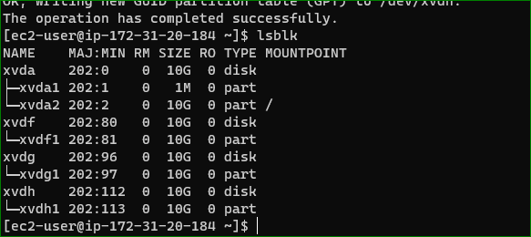
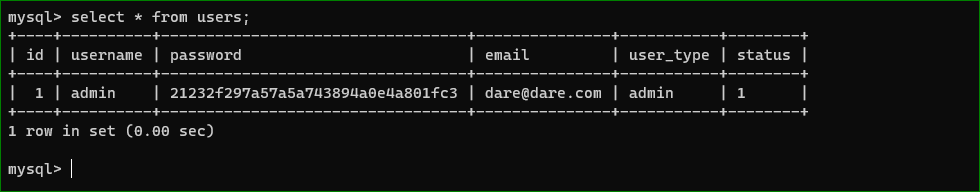
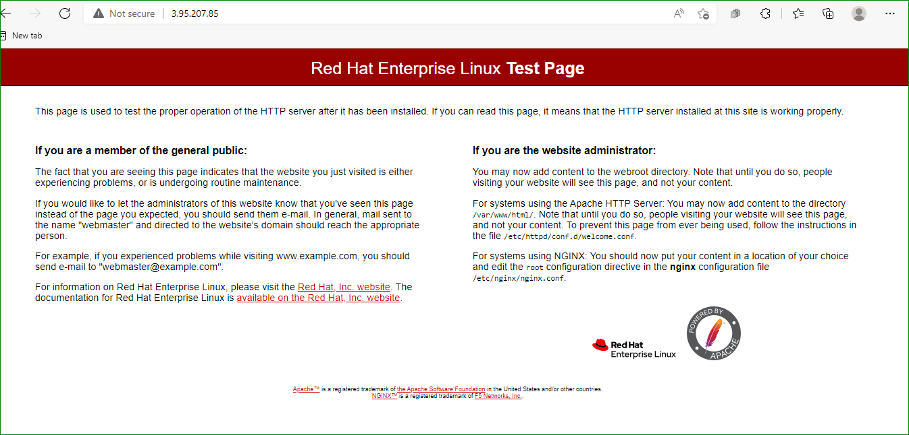
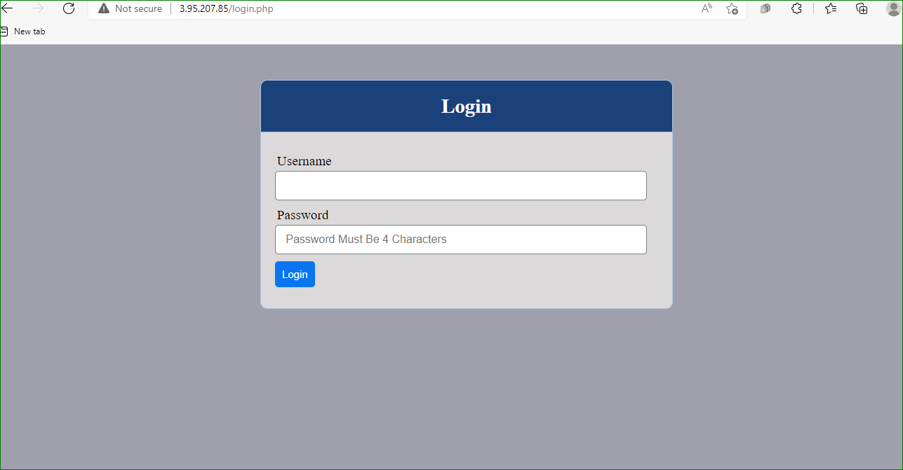

# AWESOME DOCUMENTATION OF PROJECT 7 

 *ssh into NFS server

*create 3 logical volumes

*create partitions with the gdisk command

`sudo gdisk /dev/xvdf`

`sudo gdisk /dev/xvdg`

`sudo gdisk /dev/xvdh`

`lsblk`

`sudo yum install lvm2`

`sudo pvcreate /dev/xvdf1`

`sudo pvcreate /dev/xvdg1`

`sudo pvcreate /dev/xvdh1`

`sudo pvs`

`sudo vgcreate webdata-vg /dev/xvdf1 /dev/xvdg1   /dev/xvdh1`

`sudo lvcreate -n lv-apps -L 9G webdata-vg`

`sudo lvcreate -n lv-logs -L 9G webdata-vg`

`sudo lvcreate -n lv-opt -L 9G webdata-vg`

`sudo mkfs -t xfs /dev/webdata-vg/lv-apps`

`sudo mkfs -t xfs /dev/webdata-vg/lv-logs`

`sudo mkfs -t xfs /dev/webdata-vg/lv-opt`

`sudo mkdir /mnt/apps`

`sudo mkdir /mnt/logs`

`sudo mkdir /mnt/opt`

`sudo mount /dev/webdata-vg/lv-apps /mnt/apps`

`sudo mount /dev/webdata-vg/lv-logs /mnt/logs`

`sudo mount /dev/webdata-vg/lv-opt /mnt/opt`

`sudo yum update -y`

`sudo yum install nfs-utils -y`

`sudo systemctl start nfs-server.service`

`sudo systemctl enable nfs-server.service`

`sudo systemctl status nfs-server.`service`

`sudo chown -R nobody: /mnt/apps`

`sudo chown -R nobody: /mnt/logs`

`sudo chown -R nobody: /mnt/opt`

`sudo chmod -R 777 /mnt/apps`

`sudo chmod -R 777 /mnt/logs`

`sudo chmod -R 777 /mnt/opt`

`sudo systemctl restart nfs-server.service`

`sudo vi /etc/exports`

/mnt/apps 172.31.16.0/20	(rw,sync,no_all_squash,no_root_squash)
/mnt/logs 172.31.16.0/20	(rw,sync,no_all_squash,no_root_squash)
/mnt/opt 172.31.16.0/20	(rw,sync,no_all_squash,no_root_squash)

`sudo exportfs -arv`

`rpcinfo -p | grep nfs`

*ssh into database server

`sudo apt update`

`sudo apt install mysql-server`

`sudo mysql`

`create database tooling`

`create user 'webaccess'@'172.31.16.0/20' identify by 'password'`

`grant all privileges on tooling.* to 'webaccess'@
172.31.16.0/20'`

`flush privileges`

`use tooling`

`show tables`

`select * from users`

*ssh into webserver1

`sudo yum install nfs-utils nfs4-acl-tools -y`

`sudo mkdir /var/www`

`sudo mount -t nfs -o rw,nosuid 172.31.20.184 :/mnt/apps /var/www`

`sudo vi /etc/fstab`

172.31.20.184:/mnt/apps /var/www nfs defaults 0 0

`sudo yum install httpd -y`

`sudo dnf install https://dl.fedoraproject.org/pub/epel/epel-release-latest-8.noarch.`rpm`

`sudo dnf install dnf-utils http://rpms.remirepo.net/enterprise/remi-release-8.rpm`

`sudo dnf module reset php`

`sudo dnf module enable php:remi-7.4`

`sudo dnf install php php-opcache php-gd php-curl php-mysqlnd`

`sudo systemctl start php-fpm`

`sudo systemctl enable php-fpm`

`setsebool -P httpd_execmem 1`

`sudo mount -t nfs -o rw,nosuid 172.31.20.184:/mnt/logs /var/log/httpd`

`sudo vi /etc/fstab`

172.31.20.184:/mnt/logs /var/log/httpd nfs defaults 0 0

`sudo yum install git'

`git init`

`git clone dare tooling`

`cd tooling`

`sudo cp -R html/. /var/www/html`

`cd..`

`sudo setenforce 0`

`sudo vi /etc/sysconfig/selinux`

*set SELINUX=disabled

 *load public ip on browser 3.82.38.140

 

 `sudo vi /var/www/html/functions.php`

 `cd tooling`

 `sudo yum install mysql client`

 `mysql -h 172.31.24.182 -u <db-username> -p <db-pasword> < tooling-db.sql`

 `sudo mv /etc/httpd/conf.d/welcome.conf /etc/httpd/conf.d/welcome.backup`

 `sudo systemctl restart httpd`

 

 

